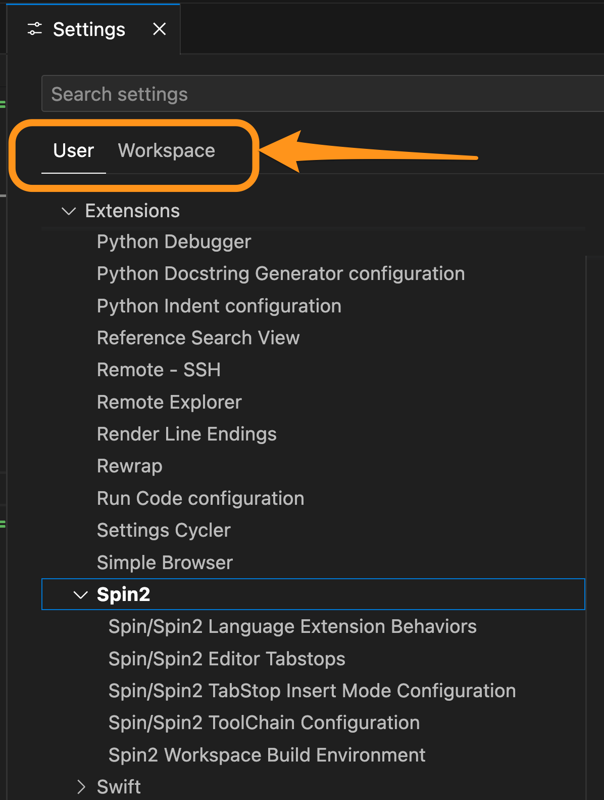
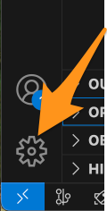
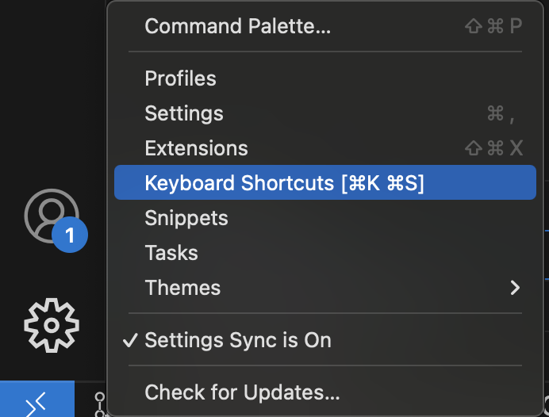

# Using the Build System found in Spin2 Extension v2.3.0 and later

![Project Maintenance][maintenance-shield]

[![License][license-shield]](LICENSE) 

This lastest build system is intended to be easier to set up, maintain, and to use than our original user tasks file mechanism.

This page attenpts to answer questions you may have as you are starting to use this build system.

## Initial Setup

We have a guided setup page [Migrate from v2.2.x to v2.3.0](Migrate-v230.md) walking you through your initial setup of the new build system.

## Locating Compilers

While the migration page has instructions for setting up your compilers on each of our supported platforms it is worth noting that if you are using a compiler installation location other than what we prescribe then as long as you have your environment variable PATH pointing to your compiler(s) then they should be found.  If you find this to not be the case file an issue at our repository [Issues Page](https://github.com/ironsheep/P2-vscode-langserv-extension/issues) and we will help you get this working.

## Compiling for P1 and P2

Our compilers work with the following propeller chips:

| Compiler | works with |
| --- | --- |
| flexspin | P1 and P2 |
| pnut_ts | P2 only |
| PNut (Windows) | P2 only |

You will find that we have a built-in key sequence that allows you to compile **the current file** you are editing to check for errors. We also have a **compile top file** key sequence which compiles your entire project checking for errors (if you have specified a top file for your current workspace.)

**NOTE**: These key sequences are predefined for each platform. You will see that we didn't have the same key sequence available on all our platforms so the modifiers will be different on each. 

## Downloading to P1 and P2

At our initial release all the compilers can build for and download to P2 Ram or Flash.  The selection of RAM or FLASH is done from the VSCode status bar toggle. 

We are still certifying the download to P1 with flexspin but you may find it already works. If it doesn't it will be working shortly in an upcoming minor release.

We have a single key sequence for downloading to the P1 or P2. And just like the Compile key sequences this is also not the same on all platofrms, the modifiers are different on each platform.

## Settings: User or Workspace

When working with settings it's even more important, with the latest build feature, that you are aware of when you are adjusting `User Settings` or `Workspace Settings`. There is a tab for each at the top of your settings page:

   
    <caption><B>Ensure you are in User or Workspace intentionally!</B></caption> 

`User` settings are for all projects where you are using VSCode. `Workspace` settings are for the current workspace (project or folder.)

The current build settings, compiler paths, command line switches, etc. are stored only in `Workspace` settings. 

**NOTE**: This is why when you visit the `Spin2 -> Spin2 Workspace Build Environment` the fields will all be empty if you have `User` tab selected. But if you, instead, select `Workspace` then most of them are filled in.

**NOTE2**: WARNING By the way, never adjust these `Spin2 -> Spin2 Workspace Build Environment` settings by hand. This is all managed by the `Spin2 Extension` at runtime.

## Toggle Debug On/Off or RAM/FLASH

If you find the VSCode status bar not affecting these behaviors during download, please check that you haven't set these settings in the **User Settings (.json)** file. If they get set there, the code seems to have a problem overriding these User Settings. They should only be in **Workspace settings (.json)**, not User Settings. As soon as I can find a means to detect this, I'll add runtime warnings, if not prevention and cleanup of this condition. 

## Locating your current keybindings or settings

There are a number of ways to get to your Keyboard bindings or to your settings. Here's one of the ways I use more often lately:

On the bottom left of your VSCode window:

   
    <caption><B>Click on the Gear Icon</B></caption> 

Now from the pop-up menu you can select `Settings` OR `Keyboard Shortcuts`:

   
    <caption><B>Select from the Gear Menu</B></caption> 

Again there a more ways to do this. This is just one of them.

## Did I miss anything?

If you have questions about something not covered here let me know and I'll add more narrative here.

*-Stephen*

## License

Licensed under the MIT License. 

Follow these links for more information:

### [Copyright](copyright) | [License](LICENSE)

[maintenance-shield]: https://img.shields.io/badge/maintainer-stephen%40ironsheep%2ebiz-blue.svg?style=for-the-badge

[marketplace-version]: https://vsmarketplacebadge.apphb.com/version-short/ironsheepproductionsllc.spin2.svg

[marketplace-installs]: https://vsmarketplacebadge.apphb.com/installs-short/ironsheepproductionsllc.spin2.svg

[marketplace-rating]: https://vsmarketplacebadge.apphb.com/rating-short/ironsheepproductionsllc.spin2.svg

[license-shield]: https://img.shields.io/badge/License-MIT-yellow.svg

[Release-shield]: https://img.shields.io/github/release/ironsheep/P2-vscode-extensions/all.svg

[Issues-shield]: https://img.shields.io/github/issues/ironsheep/P2-vscode-extensions.svg
