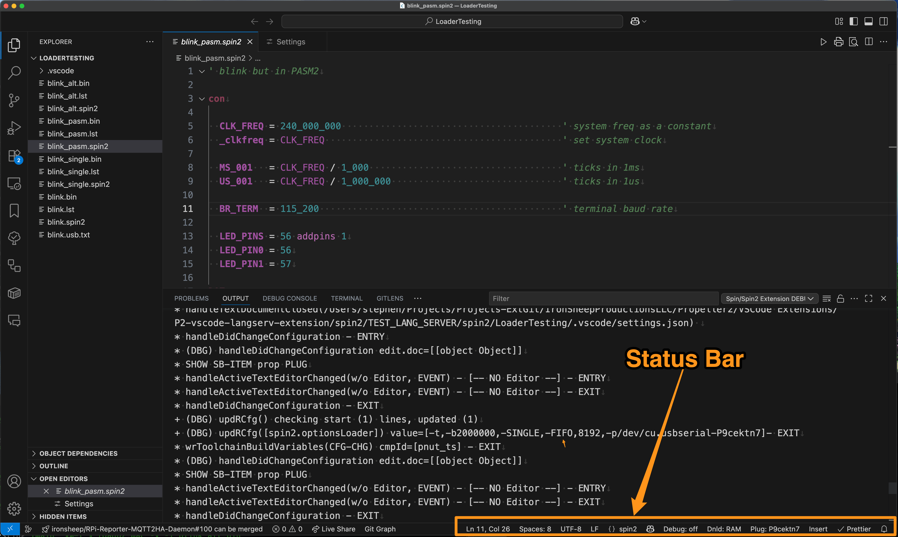
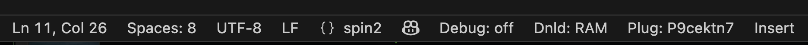

# Spin2 Extension - Status Bar Notes

![Project Maintenance][maintenance-shield]

[![License][license-shield]](LICENSE)

The Status Bar icons when editing Spin or Spin2 code now shows download controls. These new controls provide a quick means to adjust settings which affect spin code compile and download.

This page attempts to explain what these new download controls on the Status Bar do.

## The Spin2 Status Bar download controls

The VSCode Status Bar is found at the bottom right of the VSCode Application Window.

   
 

 <caption><B>Figure 1 - Location of Status Bar in the VSCode Window</B></caption> 
 

### The Spin2 Download Controls

The Spin2 download controls are present in the Status Bar when a Spin or Spin2 file is in the currently active editor tab.

   
    
<caption><B>Figure 2 - The Spin2 Status Bar Items</B></caption> 

The Spin2 Download Controls affect debug, programming port and destination of RAM, or FLASH.  These items are click-able. When clicked they toggle their state.

Here's a table showing states.

| Control | Purpose |
| --- | --- |
| Debug: [on, off] | Debug() statement compile, click to toggle.
| Dnld: [RAM, FLASH] | click to toggle download to RAM or to FLASH
| Plug: {selected Prop Plug} | Prop Plug to be used for download

**NOTE:** The Plug: item has more than two states.  It will show when no prop plugs are available, when one or more are available but none are selected or, when clicked and there is more than one Prop Plug available, it will provide a list from which you can choose the Prop Plug you'd like to use for subsequent downloads.

## NOTE: Toggle Debug On/Off or RAM/FLASH

If you find the VSCode status bar not affecting these behaviors during download, please check that you haven't set these settings in the **User Settings (.json)** file. If they get set there, the code seems to have a problem overriding these User Settings. They should only be in **Workspace settings (.json)**, not User Settings. As soon as I can find a means to detect this, I'll add runtime warnings, if not prevention and cleanup of this condition.

## Did I miss anything?

If you have questions about something not covered here let me know and I'll add more narrative here.

*-Stephen*

## License

Licensed under the MIT License.

Follow these links for more information:

### [Copyright](copyright) | [License](LICENSE)

[maintenance-shield]: https://img.shields.io/badge/maintainer-stephen%40ironsheep%2ebiz-blue.svg?style=for-the-badge

[marketplace-version]: https://vsmarketplacebadges.dev/version-short/ironsheepproductionsllc.spin2.svg

[marketplace-installs]: https://vsmarketplacebadges.dev/installs-short/ironsheepproductionsllc.spin2.svg

[marketplace-rating]: https://vsmarketplacebadges.dev/rating-short/ironsheepproductionsllc.spin2.svg

[license-shield]: https://img.shields.io/badge/License-MIT-yellow.svg

[Release-shield]: https://img.shields.io/github/release/ironsheep/P2-vscode-extensions/all.svg

[Issues-shield]: https://img.shields.io/github/issues/ironsheep/P2-vscode-extensions.svg
