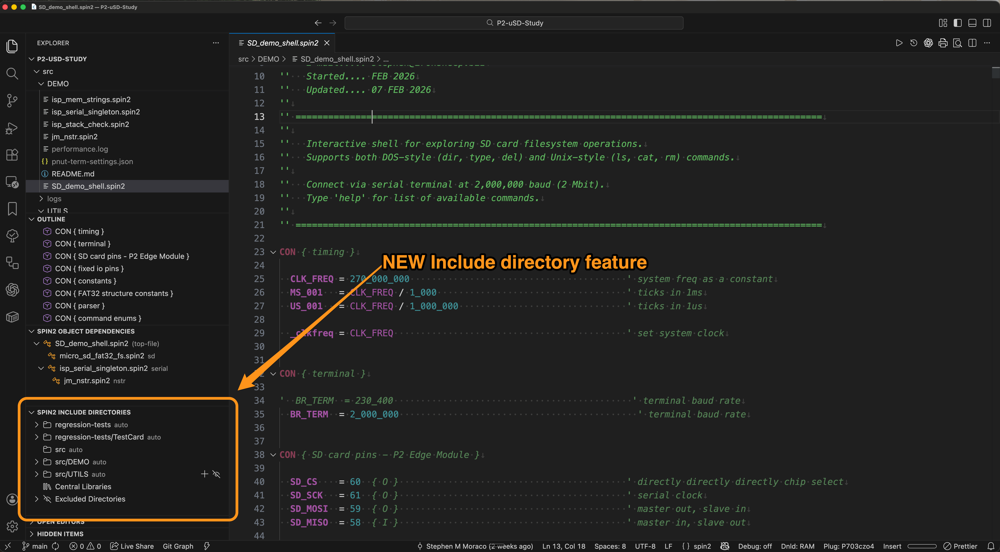

# Spin2 Extension — Include Directories

![Project Maintenance][maintenance-shield]

[![License][license-shield]](LICENSE)


The **Spin2 Include Directories** panel is a new addition to the Explorer sidebar. It solves a common problem: when your Spin2 project has source files organized across multiple subdirectories, the compiler and the language server need to know where to find them all.

This page attempts to explain what the new Include Directory panel controls do.

## The Spin2 Include Directory panel controls

The VSCode Spin2 Include Directory panel is found in the left column of the VSCode Application Window.

<p align="left">
  <br>
 <p align="center">
 <caption><B>Figure 1 - Location of Include Directories panel in the VSCode Window</B></caption><br>
 </p>
</p>

### Using the Spin2 Include Directory panel

Consider an OBJ section like this:

```spin2
OBJ
  color   : "isp_hub75_color"
  display : "isp_hub75_display"
```

The compiler needs to locate `isp_hub75_color.spin2` and `isp_hub75_display.spin2`. If those files live in a different folder than the file referencing them, neither the compiler nor the extension can find them without help.

The Include Directories feature handles this for you. It scans your workspace, reads the OBJ references in your `.spin2` files, and figures out which directories contain the objects each folder needs. From there it:

- **Tells the compiler** where to look (by generating `-I` flags for FlexSpin and PNut-TS)
- **Tells the language server** where to look (so hover documentation, go-to-definition, and semantic highlighting all work across file boundaries)

In short: you organize your project however you like, and the extension makes sure everything still connects.

## Enabling the Feature

The Include Directories panel is part of the Advanced Toolchain feature set. To turn it on:

1. Open **Settings** (Ctrl+Comma / Cmd+Comma)
2. Search for `spinExtension.toolchain.advanced.enable`
3. Check the box

The **Spin2 Include Directories** panel will appear in your Explorer sidebar.

## What You'll See in the panel

The panel has up to three sections:

**Per-Folder Includes** — Each subfolder in your workspace that contains `.spin2` files gets its own entry. Expand it to see the directories the scanner discovered for that folder. Each entry is labeled **auto** (the scanner is managing it) or **customized** (you've made manual changes and the scanner won't overwrite them).

**Central Libraries** — A section for shared library directories that you want available to every project on your machine. Think of this as your personal OBEX collection or a team-shared driver folder. These paths are configured once in your user settings and apply everywhere.

**Excluded Directories** — Directories you've told the scanner to skip entirely. Useful for keeping reference code, archived examples, or downloaded collections from showing up in your include paths.

## Getting Started with an Existing Project

When you first open VS Code in a project directory that already has `.spin2` files — perhaps spread across several subfolders — the extension scans your workspace automatically. Here's what to do next:

1. **Open the Include Directories panel** in the Explorer sidebar.

2. **Review the auto-discovered paths.** The scanner has read every OBJ reference in your source files and matched them to directories in your workspace. These are the directories the compiler will search during builds. Take a moment to make sure they look right.

3. **Exclude what doesn't belong.** If your workspace contains directories of reference code, old examples, or downloaded libraries that shouldn't be part of your build, exclude them now. Click the eye-closed icon on the folder entry. This keeps stale or unrelated files from being picked up as include targets.

4. **Check the order.** If two directories contain a file with the same name, the one listed first wins. Use the arrow buttons to promote the directory you want the compiler to find first.

5. **Build.** The extension automatically generates the right `-I` flags. The language server is already using the discovered paths for hover help, navigation, and highlighting.

This review step is important — it's the moment where you confirm the scanner's findings match your project's intent. A few seconds here can save you from a confusing build error later.

## Starting a New Project (or Adding Files to an Existing One)

If you're starting fresh with an empty workspace, or you've just added new `.spin2` files and subdirectories, the scanner may not have seen them yet. Here's the workflow:

1. **Add your source files.** Create subdirectories, drop in your `.spin2` files, organize however you like.

2. **Hit Refresh.** Click the circular-arrow button in the Include Directories panel title bar. The scanner walks the entire workspace, finds all `.spin2` files, reads their OBJ references, and builds the include directory map.

3. **Review the results.** The same review process as above — check paths, exclude what doesn't belong, adjust order if needed.

Any time you restructure your project — moving files, adding new folders, pulling in objects from external sources — a Refresh picks up all the changes.

## When Objects Can't Be Found

A common situation: you add a new `.spin2` file, or add a new OBJ reference, and the compiler suddenly can't find the referenced object. The language server might stop providing hover or navigation for it too. Here's how to get back on track:

1. **Rescan.** Click **Refresh** in the Include Directories panel. The scanner discovers the new file's location and updates include paths accordingly.

2. **Check the tree.** After the rescan, expand the affected folder entry. The new directory should appear in its include list. If it doesn't, the referenced file may not exist yet, or it may be in an excluded directory.

3. **Check exclusions.** If the file is inside a directory you previously excluded (or a subdirectory of one), the scanner won't see it. Remove the exclusion and rescan.

4. **Check Central Libraries.** If the object lives outside your workspace entirely — in a shared library folder or an OBEX collection — add that directory as a Central Library path so it's searchable.

## How Search Order Works

When the compiler or language server looks for a referenced object, directories are searched in this order:

1. **The source file's own directory** — always checked first
2. **Per-folder local includes** — in the order shown in the tree view
3. **Central library paths** — in the order shown in the tree view

First match wins. If you need to control which version of a file is used, adjust the order with the arrow buttons.

## Tips

- **Let auto mode do the work.** The scanner re-runs when files are created, deleted, or renamed in your workspace. Manual customization is there for edge cases — most of the time, auto discovery has you covered.

- **Exclude early.** Large directories of reference code or downloaded examples slow down scanning and can introduce unexpected matches. Exclude them right away.

- **Central Libraries for shared code.** Configure your personal OBEX collection or team library once, and every project benefits automatically.

- **Order matters.** Development version and stable version in different directories? Put the one you want first. The arrow buttons are your friend.

---

## Reference

The sections below provide detailed information about settings and all available interactions. You don't need this to get started — it's here when you need to look something up.

### Settings

#### Central Library Paths

| | |
|---|---|
| **Setting** | `spinExtension.library.includePaths` |
| **Scope** | User (global — applies to all projects) |
| **Type** | Array of strings (absolute directory paths) |
| **Default** | `[]` |

Shared library directories searched after local project includes. Supports `~/` for your home directory. Order matters — first match wins.

#### Per-Folder Local Includes

| | |
|---|---|
| **Setting** | `spin2.localIncludes` |
| **Scope** | Workspace (stored in `.vscode/settings.json`) |
| **Type** | Object (managed by the tree view) |
| **Default** | `{}` |

Maps each project subfolder to its list of include directories. Entries are marked `auto` (managed by discovery) or `customized` (manually adjusted — discovery won't overwrite). You generally won't edit this directly; the tree view manages it.

#### Excluded Directories

| | |
|---|---|
| **Setting** | `spin2.excludeIncludeDirectories` |
| **Scope** | Workspace (stored in `.vscode/settings.json`) |
| **Type** | Array of strings (relative to workspace root) |
| **Default** | `[]` |

Directories to skip during discovery. Each excluded path also excludes all its subdirectories.

### All Available Interactions

#### Title Bar

| Button | Icon | Action |
|--------|------|--------|
| Refresh | Circular arrow | Re-scans the workspace and rebuilds all include directory mappings |

#### Per-Folder Entries

| Interaction | Icon / Menu | When Available | Action |
|------------|-------------|----------------|--------|
| Add directory | + (inline) | Auto-discovered folders | Opens a folder picker to add an include directory. Switches the folder to "customized" mode. |
| Exclude folder | Eye-closed (inline) | All folder entries | Excludes this folder and all subdirectories from discovery. Also scrubs references to it from other folders. |
| Exclude folder | Right-click menu | All folder entries | Same as the inline exclude button. |
| Reset to Auto | Right-click menu | Customized folders only | Discards manual changes, returns to auto-discovered mode. |

#### Include Directory Entries (children of per-folder entries)

| Interaction | Icon / Menu | Action |
|------------|-------------|--------|
| Move Up | Arrow up (inline) | Moves this directory higher in search order (higher priority) |
| Move Down | Arrow down (inline) | Moves this directory lower in search order (lower priority) |
| Remove | Trash (inline) | Removes this directory from the folder's include list |
| Edit | Right-click menu | Opens an input box to modify the directory path |

#### Central Libraries Section

| Interaction | Icon / Menu | Action |
|------------|-------------|--------|
| Add library | + (inline on section header) | Opens a folder picker to add a central library directory |

#### Central Library Entries

| Interaction | Icon / Menu | Action |
|------------|-------------|--------|
| Move Up | Arrow up (inline) | Moves this library higher in search order |
| Move Down | Arrow down (inline) | Moves this library lower in search order |
| Remove | Trash (inline) | Removes this central library path |
| Edit | Right-click menu | Opens an input box to modify the library path |

#### Excluded Directories Section

| Interaction | Icon / Menu | Action |
|------------|-------------|--------|
| Add exclusion | + (inline on section header) | Opens a folder picker to add a directory to the exclusion list |

#### Excluded Directory Entries

| Interaction | Icon / Menu | Action |
|------------|-------------|--------|
| Remove | Trash (inline) | Removes this exclusion and triggers an automatic rescan |

## Did I miss anything?

If you have questions about something not covered here let me know and I'll add more narrative here.

*-Stephen*

## License

Licensed under the MIT License.

Follow these links for more information:

### [Copyright](copyright) | [License](LICENSE)

[maintenance-shield]: https://img.shields.io/badge/maintainer-stephen%40ironsheep%2ebiz-blue.svg?style=for-the-badge

[marketplace-version]: https://vsmarketplacebadges.dev/version-short/ironsheepproductionsllc.spin2.svg

[marketplace-installs]: https://vsmarketplacebadges.dev/installs-short/ironsheepproductionsllc.spin2.svg

[marketplace-rating]: https://vsmarketplacebadges.dev/rating-short/ironsheepproductionsllc.spin2.svg

[license-shield]: https://img.shields.io/badge/License-MIT-yellow.svg

[Release-shield]: https://img.shields.io/github/release/ironsheep/P2-vscode-extensions/all.svg

[Issues-shield]: https://img.shields.io/github/issues/ironsheep/P2-vscode-extensions.svg
