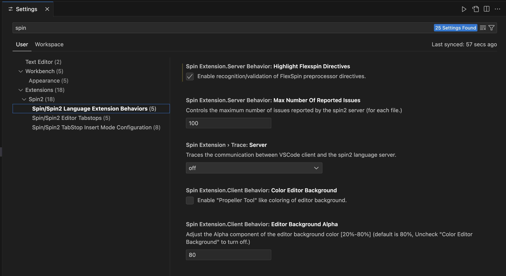
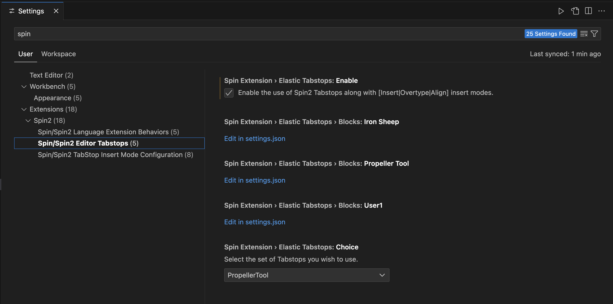
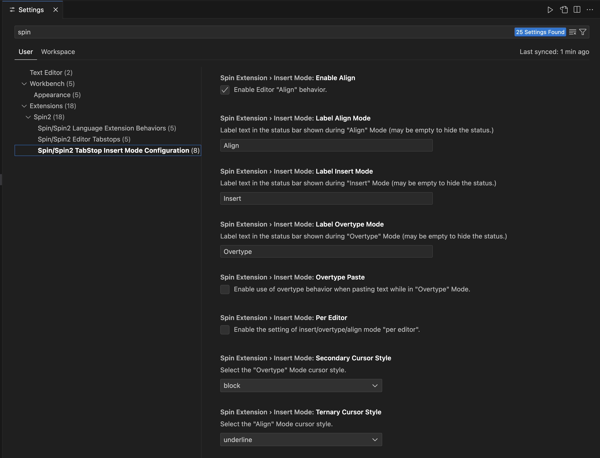

# VSCode support for the Parallax Propeller 1 & 2 Multicore MCU's

![Project Maintenance][maintenance-shield]
[![License][license-shield]](LICENSE) 

## Our Spin/Spin2 VSCode Extension Settings

In general To open the Settings editor, navigate to **[Code]** > **Settings** > **Settings**.

The Spin2 extension settings are in 3 sections.  If when you get to settings and type in "**SpinExt**" as a filter and you'll see the 3 sections of our new Spin2 Extension settings:

**FIGURE 1**: Our three sections, with the first section selected

- **Highlight FlexSpin directives** - This enables support for #if, #else, etc. FlexSpin directives
- **Max Number of Reported Issues** - This allows you to limit how many messages are shown per file
- **Trace Server**- boared? want to see how the client interacts with the server then select a value here other then off. (this can slow things down)
- **Color Editor Background** - check this to turn on Propeller Tool coloring (you'll also need to adjust the color theme to make this readable!)
- **Editor Background Alpha** - if you wnat to something a bit darker then you can adjust this.

Click on the 2nd section to see:

**FIGURE 2**: with he 2nd section selected

- Elastic Tabstops **Enable** - check this to turn ON the Elastic Tabstops feature
- **Iron Sheep** - click on link to adjust the tab columns (default is what the Author uses)
- **Propeller Tool**- click on link to adjust the tab columns (default is Propeller Tool defaults)
- **User1** - click on link to adjust the tab columns (this one is meant for you to customize if you wnat your own settings)
- Elastic Tabstops **Choice** - select the set of tabstops you wish to use

Click on the 3rd section to see:

**FIGURE 3**: with the 3rd section selected

Insert Mode Adjustments:

- **Enable Align** - Adds Align mode to modes: Insert and Overtype
- **Label Align Mode**- Change the default label text
- **Label Insert Mode**- Change the default label text
- **Label Overtype Mode**- Change the default label text
- **Overtype Paste** - Alters paste behavior when in Overtype mode
- **Per Editor** - Let's each editor have it's own current mode setting (Default off)
- **Secondary Cursor Style** - Adjusts the Overtype cursor
- **Ternary Cursor Style** - Adjusts the Align cursor

## License

Licensed under the MIT License. 

Follow these links for more information:

### [Copyright](copyright) | [License](LICENSE)

[maintenance-shield]: https://img.shields.io/badge/maintainer-stephen%40ironsheep%2ebiz-blue.svg?style=for-the-badge

[marketplace-version]: https://vsmarketplacebadge.apphb.com/version-short/ironsheepproductionsllc.spin2.svg

[marketplace-installs]: https://vsmarketplacebadge.apphb.com/installs-short/ironsheepproductionsllc.spin2.svg

[marketplace-rating]: https://vsmarketplacebadge.apphb.com/rating-short/ironsheepproductionsllc.spin2.svg

[license-shield]: https://img.shields.io/badge/License-MIT-yellow.svg

[Release-shield]: https://img.shields.io/github/release/ironsheep/P2-vscode-extensions/all.svg

[Issues-shield]: https://img.shields.io/github/issues/ironsheep/P2-vscode-extensions.svg
