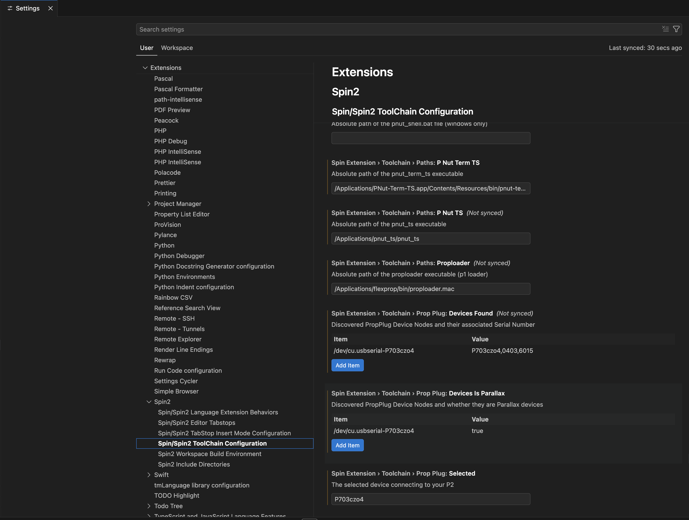
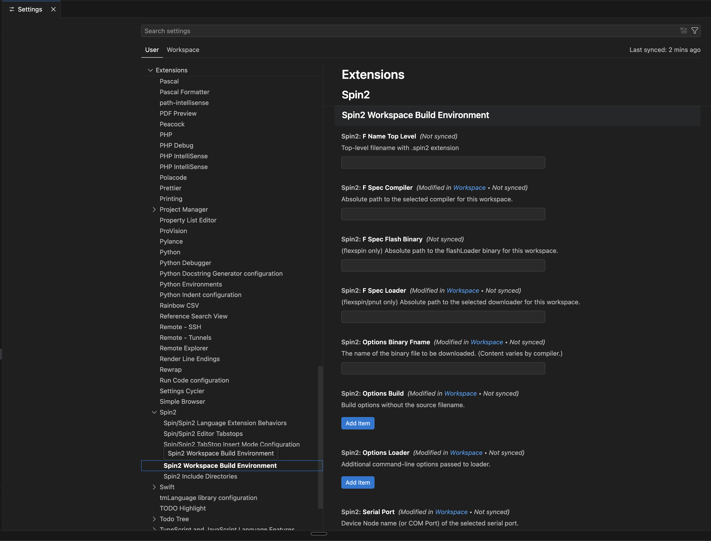
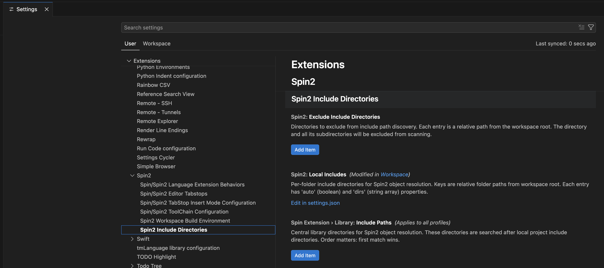

# Spin2 Extension — Settings and Keyboard Mapping

![Project Maintenance][maintenance-shield]
[![License][license-shield]](LICENSE)

## Our Spin/Spin2 VSCode Extension Settings

In general To open the Settings editor, navigate to **[Code]** > **Settings** > **Settings**.

The Spin2 extension settings are in 6 sections.  If when you get to settings and type in "**SpinExt**" as a filter and you'll see the 6 sections of our new Spin2 Extension settings:

## Spin2 Settings - Section 1 - Extension Behaviors

   
 

 <caption><B>Figure 1 - Settings Section: Spin/Spin2 Language Extension Behaviors</B></caption> 
 

- **Color Editor Background** - check this to turn on Propeller Tool coloring (you'll also need to adjust the color theme to make this readable!)
- **Editor Background Alpha** - if you want to something a bit darker then you can adjust this.
- **Author File Prefix** - Your personal file-name prefix (for example, `isp_`). When set, Rename Symbol will skip files that belong to a different author, protecting objects written by other people. Generally, you don't want to leave this blank if you are using a filenaming conventions for your files. Exception: Leave this blank to rename across all files (but be very careful). See [File Ownership and Safety](Spin2-code-navigation.md#file-ownership-and-safety) for details.
- **Highlight FlexSpin directives** - This enables support for #if, #else, etc. FlexSpin directives
- **Max Number of Reported Issues** - This allows you to limit how many messages are shown per file
- **Trace Server**- bored? want to see how the client interacts with the server then select a value here other then off. (this can slow things down)

## Spin2 Settings - Section 2 - Editor Tabstops

Click on the 2nd section to see:

   
 

 <caption><B>Figure 2 - Settings Section: Spin/Spin2 Editor Tabstops</B></caption> 
 

- Elastic Tabstops **Enable** - check this to turn ON the Elastic Tabstops feature
- **Iron Sheep** - click on link to adjust the tab columns (default is what the Author uses)
- **Propeller Tool**- click on link to adjust the tab columns (default is Propeller Tool defaults)
- **User1** - click on link to adjust the tab columns (this one is meant for you to customize if you want your own settings)
- Elastic Tabstops **Choice** - select the set of tabstops you wish to use

## Spin2 Settings - Section 3 - Insert Mode

Click on the 3rd section to see:

   
 

 <caption><B>Figure 3 - Settings Section: Spin/Spin2 Tabstop Insert Mode Configuration</B></caption> 
 

Insert Mode Adjustments:

- **Enable Align** - Adds Align mode to modes: Insert and Overtype
- **Label Align Mode**- Change the default label text (default: **Align**)
- **Label Insert Mode**- Change the default label text (default: **Insert**)
- **Label Overtype Mode**- Change the default label text (default: **Overtype**)
- **Overtype Paste** - Alters paste behavior when in Overtype mode (default: overtype)
- **Per Editor** - Let's each editor have it's own current mode setting (Default: off)
- **Secondary Cursor Style** - Adjusts the Overtype cursor (Default: block)
- **Ternary Cursor Style** - Adjusts the Align cursor (Default: underline)

## Spin2 Settings - Section 4 - ToolChain Configuration

Click on the 4th section to see:

   
 

 <caption><B>Figure 4a - Settings Section: Spin/Spin2 ToolChain Configuration (showing first group of entries)</B></caption> 
 

and scroll down to:

   
 

 <caption><B>Figure 4b - Settings Section: Spin/Spin2 ToolChain Configuration (showing first group of entries)</B></caption> 
 

and scroll down further to:

   
 

 <caption><B>Figure 4c - Settings Section: Spin/Spin2 ToolChain Configuration (showing first group of entries)</B></caption> 
 

ToolChain Adjustments:

You will be modifying only a couple of the values in this section. The remainder are determined when VSCode starts or when you interact with status-bar controls. The following are the values you will be periodically adjusting.

- **Enable Advanced Toolchain support** - This enables all of the toolchain behaviors (off by default)
- **Installations Found** - Lists which compilers were found to be installed on this machine
- **Selected Compiler** - Choose the compiler you wish to use (set for User/Workspace)
- **Enable listing output**- Enable/disable .lst file output (default: enabled)
- **Flexspin Debug**- Select between -gbrk and -g
- **Enable Compatibility PST**- selects which terminal behavior will be used
- **Enter Terminal After**- select one of [ never, when debug() enabled, or always ]
- **User Pnut Term TS** - enable to use pnut-term-ts with all compilers (default: disabled, use only with pnut-ts)
- **User Baudrate**- Enter the comms rate for you application serial debug output

The following affect visiblity and control of non-Parallax PropPlugs:

- **Match Vendor Only** - opens up filter to allow non-parallax Serial Devices
- **Serial Control** - specifies which control form to use for non-parallax Serial devices

The following are adjusted by clicking on status bar controls:

- **Enable Debug()** - Click on "debug:[ON/off]" StatusBar control
- **Enable Flash**- Click on "Dnld:[RAM/FLASH]" StatusBar control

 The remaining items in this section are visual feedback to you to see what the **toolchain discovery mechanism** has found with respect to the tools you have installed.

In general, you want to look here after installing any compilers to see if they were discovered correctly.

The 'paths' entries are all runtime configured. **Please do not adjust any of these paths.**

- **Prop Plug: devices found**- lists which prop plugs are plugged into usb ports

The following is adjusted by clicking on status bar controls:

- **Prop Plug: Selected**- Shows which prop plug you are downloading to. Click on "plug:[name, N/A]" StatusBar control to change this.

## Spin2 Settings - Section 5 - Workspace Build Environment

   
 

 <caption><B>Figure 5 - Settings Section: Spin2 Workspace Build Environment</B></caption> 
 

**WARNING** there are no user configurable options here. This page was automatically genrated when we added the persistance of our user and workspace tool selections.  You can click on User and Workspace tabs for this section to review the current settings. **But do not change anything here as any changes you make will be overwritten.**

## Spin2 Settings - Section 6 - Include Directories

   
 

 <caption><B>Figure 6 - Settings Section: Spin2 Include Directories</B></caption> 
 

Once again this section is pretty much for reference only. You will generally manipulate these values by interacting with the Spin2 Include Directories panel in the left column of your VSCode window. See [Spin2 Extension — Include Directories](./Spin2-Include-Directories.md) for how to use that control.

## Our Spin/Spin2 VSCode Key Mapping

In general To open the Settings editor, navigate to **[Code]** > **Settings** > **Keyboard Shortcuts**.

The keyboard mappings are different on Windows than they are on Mac, RPi or Linux.

### The Key Mapping on Windows:

**FIGURE 6**: Keyboard Shortcuts screen on Windows.

### The Key Mapping on RPi, Linux:

**FIGURE 7**: Keyboard Shortcuts screen on RPi and Linux.

### The Key Mapping on MacOS:

**FIGURE 8**: Keyboard Shortcuts screen on macOS.

## Did I miss anything?

If you have questions about something not covered here let me know and I'll add more narrative here.

*-Stephen*

## License

Licensed under the MIT License.

Follow these links for more information:

### [Copyright](copyright) | [License](LICENSE)

[maintenance-shield]: https://img.shields.io/badge/maintainer-stephen%40ironsheep%2ebiz-blue.svg?style=for-the-badge

[marketplace-version]: https://vsmarketplacebadges.dev/version-short/ironsheepproductionsllc.spin2.svg

[marketplace-installs]: https://vsmarketplacebadges.dev/installs-short/ironsheepproductionsllc.spin2.svg

[marketplace-rating]: https://vsmarketplacebadges.dev/rating-short/ironsheepproductionsllc.spin2.svg

[license-shield]: https://img.shields.io/badge/License-MIT-yellow.svg

[Release-shield]: https://img.shields.io/github/release/ironsheep/P2-vscode-extensions/all.svg

[Issues-shield]: https://img.shields.io/github/issues/ironsheep/P2-vscode-extensions.svg
