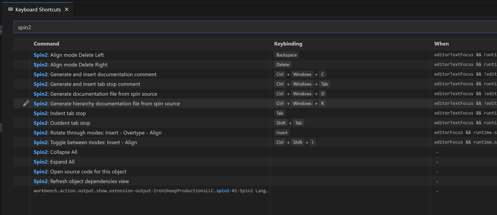
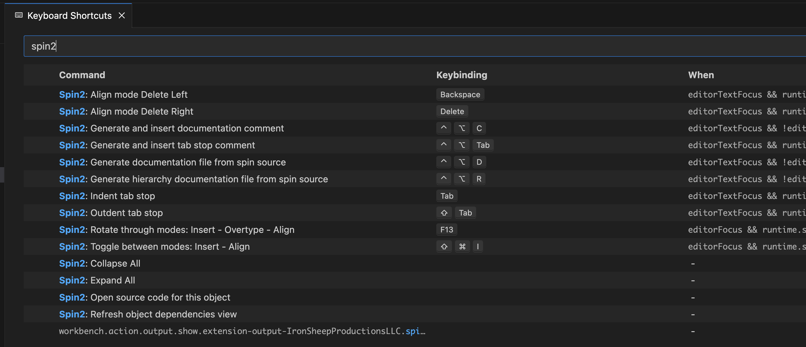

# VSCode support for the Parallax Propeller 1 & 2 Multicore MCU's

![Project Maintenance][maintenance-shield]
[![License][license-shield]](LICENSE) 

## Our Spin/Spin2 VSCode Extension - Keystroke planner

We have many functions in our VSCode Spin2 Extension that can be activated from the keyboard. This senction lays them all out so we can plan/mark-up our current values to determine better ones that don't have collisions with system defined sequences.

| Desired Key | Purpose | Linux | MacOS | Windows 
| --- | --- | --- | --- | --- 
| | --------- **Doumentation Commands** ---------
| c | Generate PUB/PRI Doc. Comment | Ctrl+Alt+c | Ctrl+Alt+c | Ctrl+Alt+c
| d | Generate Object Public Interface Doc. | Ctrl+Alt+d | Ctrl+Alt+d | Ctrl+Alt+d
| h | Generate Project Object Hierarchy Doc. | Ctrl+Alt+h | Ctrl+Alt+h | Ctrl+Alt+h
| u | Generate USB Doc. | Ctrl+Alt+u | Ctrl+Alt+u | Ctrl+Alt+u
| | --------- **Compile/Download Support Commands** ---------
| C | Compile Current Spin2 File | Ctrl+Shift+Alt+C | Ctrl+Shift+C | Ctrl+Shift+Alt+C
| T | Compile TopLevel Spin2 File | Ctrl+Shift+Alt+T | Ctrl+Shift+T | Ctrl+Shift+Alt+T
| D | Download Binary File | Ctrl+Shift+D Ctrl+F11 | Ctrl+Shift+D F11 | Ctrl+Shift+Alt+D F11
| f | TOGGLE download to FLASH / RAM | Ctrl+Alt+f | Ctrl+Alt+f | Ctrl+Alt+f
| g | TOGGLE debug() compile | Ctrl+Alt+g | Ctrl+Alt+g | Ctrl+Alt+g
| n | Select USB port (when more than one) | Ctrl+Alt+n | Ctrl+Alt+n | Ctrl+Alt+n
| | --------- **Elastic TabStop Support** ---------
| tab | indent (move code right) | tab | tab | tab
| TAB | outdent (move code left) | Shift+TAB | Shift+TAB | Shift+TAB
| tab | Generate tab-stops comment | Ctrl+Alt+tab | Ctrl+Alt+tab | Ctrl+Alt+tab
| --- | Rotate Insert Mode \[ ->Align->Overtype->Insert-> \] | Insert | F9 | Insert
| backspace | Delete char to left of cursor | backspace | backspace | backspace
| delete | Delete char to right of cursor | delete | delete | delete
| ---| TOGGLE Insert Mode \[ Insert<->Align \] | Ctrl+Alt+Shift+I | Cmd+Shift+I | Ctrl+Alt+I

### Key Prefixes by platform

| Key Name | Key | Linux | MacOS | Windows| Notes
| --- | --- | --- | --- | --- | ---
| Ctrl | Control Key | x | x | x
| Shift | Shift Key | x | x | x
| Alt | Alt Key | x | x | x
| cmd | Command Key |   | x |  
| win | Windows Key |   |   | x | VSCode has problems recognizing this!??

### Assignment values to use in package.json

When we assign keys to commands in the `package.json` file we use the following Assignment values to denote on which platform(s) they key sequence should be used.

| Assignment | Linux | MacOS | Windows 
| --- | --- | --- | --- 
| "key" | x | x | x
| "linux" | x |   |  
| "mac" |   | x |  
| "windows" |   |   | x

## Our Spin/Spin2 VSCode Key Mapping

In general To open the Settings editor, navigate to **[Code]** > **Settings** > **Keyboard Shortcuts**.

The keyboard mappings are different on Windows than they are on Mac, RPi or Linux. This was our mapping before we added build/download support.  You can see the NEW mappings at [Our Spin/Spin2 VSCode Key Mapping](https://github.com/ironsheep/P2-vscode-langserv-extension/blob/flasher/Spin2-Settings.md#our-spinspin2-vscode-key-mapping)

### Prior Key Mapping on Windows:

**FIGURE 4**: Keyboard Shortcuts screen on Windows.

### Prior Key Mapping on MacOS, RPi, Linux:

**FIGURE 5**: Keyboard Shortcuts screen on Mac (same on RPi and Linux).

## License

Licensed under the MIT License. 

Follow these links for more information:

### [Copyright](copyright) | [License](LICENSE)

[maintenance-shield]: https://img.shields.io/badge/maintainer-stephen%40ironsheep%2ebiz-blue.svg?style=for-the-badge

[marketplace-version]: https://vsmarketplacebadge.apphb.com/version-short/ironsheepproductionsllc.spin2.svg

[marketplace-installs]: https://vsmarketplacebadge.apphb.com/installs-short/ironsheepproductionsllc.spin2.svg

[marketplace-rating]: https://vsmarketplacebadge.apphb.com/rating-short/ironsheepproductionsllc.spin2.svg

[license-shield]: https://img.shields.io/badge/License-MIT-yellow.svg

[Release-shield]: https://img.shields.io/github/release/ironsheep/P2-vscode-extensions/all.svg

[Issues-shield]: https://img.shields.io/github/issues/ironsheep/P2-vscode-extensions.svg
