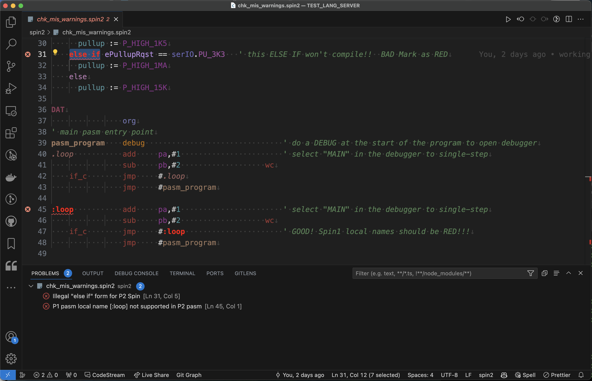

# VSCode support for the Parallax Propeller 1 & 2 Multicore MCU's

![Project Maintenance][maintenance-shield]
[![License][license-shield]](LICENSE) 

## Early Testing of the new Language-Server based VSCode Extension

Hi everyone and thank you for being willing to exercide this new version and provide feedback!

Let get you quickly running the new extension.

## Table of Contents

On this Page:

- [Set up](#s--setup) - remove old extension(s), install new, select theme
- [Testing](#t--testing) - review your existing code using the new VSCode, report (via email) anything that needs to be fixed
- [Reference](#reference) - help with settings or themes or even reverting to the prior version

Additional pages:

- [TOP Level README](../README.md) - Back to the top page of this repo


## [S-] Setup

There are a couple of steps to remove the older Spin2 extension versionn, install the new, and enable the "**Error Lens**" extension. Once you do this you are ready to run VScode as you normally do.

### [S0] Shutdown all VSCode instances

We are updating the extensions. So let's first shutdown all VSCode instances then switch them out.

### [S1] Remove any existing Spin2 extensions

- Browse to where your VSCode extensions are installed: See [Where are extensions installed?](https://code.visualstudio.com/docs/editor/extension-marketplace#_common-questions)
- Remove all ironsheep versions `ironsheepproductionsllc.spin2-*` 
  - (NOTE: **ironsheepproductionsllc.spin2-1.9.16/** is the latest, remove it too!)

### [S2] Install the new version from the command line

Look for the spin2-2.0.0.vsix.zip I sent you in email.  Download it and unzip it.
Within the directory where is now lives, unzipped, run:

```bash
code --install-extension spin2-2.0.0.vsix
```

oh, yes, please ignore the warning that we always get:

```bash
Installing extensions…
(node:13248) [DEP0005] DeprecationWarning: Buffer() is deprecated due to security and usability issues.
Please use the Buffer.alloc(), Buffer.allocUnsafe() or BufferFrom() methods instead.
(Use ‘Code –trace-deprecation …’ to show where the warning was created)
```

It should now be installed

### [S3] Setup extensions we use

- Ensure [Error Lens](https://marketplace.visualstudio.com/items?itemName=usernamehw.errorlens) extension is installed


**FIGURE 1**: The Error Lens Extension

When you DON'T have error Lens installed (or it is disabled) Your errors (highlighted in the code as bright RED text) only show in bottom area in the [Problems] Tab:


**FIGURE 2**: Code with errors, except error messages are only shown in bottom panel

When you DO have error Lens installed and enabled then your error messages are additionally shown on the line which contains the error:


**FIGURE 3**: Code with errors, but now errors are also shown in the code on the exact line

### [S4] Select your preferred theme

If you don't use Propeller Tool like background coloring then select one of:


1. **Spin2 Ironsheep Light** - Light Mode no backround coloring
1. **Spin2 Ironsheep Dark** - Dark Mode no backround coloring

If, instead you do use Propeller Tool background coloring then select one of these (and also enable backgroudn coloring in settings [See: Help with settings](#r2-help-with-settings)):

1. **Spin2 Ironsheep Light for background Color** - Light Mode use with **Propeller Tool** coloring 
2. **Spin2 Ironsheep Dark for background Color** - Dark Mode use with **Propeller Tool** coloring 

To activate a theme, open the Color Theme Selector, navigate to **Code** > **Settings** > **Theme** > **Color Theme** and then arrow down to the desired theme.

## [T-] Testing

You are ready to use VScode as you did before. The difference is that you will be seeing the output from the new language-server-based-extension when you edit .spin or .spin2 files.

I find the new features fun to use. Here's a brief summary:

- **Syntax and Semantic Highlighting** works as before
- **Issues found** with code are highlighted in red but also now have **problem descriptions**
- **Declared objects** in your code are now parsed and references to **constants** and **methods** within them are validated! An error is presented for any reference not found in the included file. This includes local constant overrides on the object declaration line.
- **Files** listed in your code (declared objects or included data files) are **checked to see if they exist**. An error is presented if they are not present in the same directory.
- **Hover help** is presented for all data or method names in your code along with all spin built-in methods, smart pin constants or streamer constants, if you are hovering over an external object reverence to a constant or method the help text is brought in from that external file
- **Signature help** is presented as you type a method signature. It is presented when you first type the "(" open parenthesis. Likewise signature help for a method from an included object the help text is brought in from the external file.
- **Multiple files open** in editor. Open the top level file in your project. Open an included object file to the right.  Changes you make in the object file will immediately cause changes in the top-level file to the left if you are adjusting the public interface.
- **Porting Help**: moving P1 code to P2 or moving P2 code to P1... when you rename the file to spin or .spin2 then the highlighter can generate warnings when P1 code is present in a P2 file and vice versa.
- **Object Public interface documentation generation** via keystroke [Ctrl+Alt+d], doc opens on right side of editor
- **Doc-Comment Generation** for PUB and PRI methods via keystroke [Ctrl+Alt+c] - Ctrl+Alt+( c )omment.<BR>(Comment is inserted immediately below the PUB or PRI line.)
- **Editor Screen Coloring** support per section à la Parallax Propeller Tool
- **Custom tabbing Tab-stop support** per section à la Parallax Propeller Tool
- **Tab Sets You can choose between** Propeller Tool, IronSheep, and User1 (adjust in settings to make your favorite set)
- File navigation from **Outline View**
- File navigation from **Object Hierarchy View**
- **Editor insert Mode support** à la Parallax Propeller Tool [Insert, Overtype and Align]
- Provides **rich companion themes** for use with non-color backgrounds or with colored backgrounds as well as Syntax only theme (mostly used during semantic highlighting development

### [T1] What are we trying to learn with your early testing?

We are looking for any **failures of the Syntax/Semantic Highlighting** or **Reported errors which are not correct** or even any case where **errors should be reported but are not**.

This editor is a highlighter for "formal" Spin/Pasm for the P1 and Spin2/P2asm for the P2. AS such if the code compiles correctly under PNut or Propeller Tool then we expect this Spin2 extension to be able to correctly parse and highlight the same code. If the P2 Spin doc and the P1 Spin docs say we can code it a certain way then this editor should be able to understand it and higlight it correctly.

If something does not seem to be correct then I wnat to know so I can make it more correct.

#### NOTE: Don't bother reporting these...

There is at least one known issue with the current parser:

- It does NOT yet handle line-continuations.  The subsequent lines are just not highlighted.  This will be fixed in an upcoming release.

### [T2] Reporting things you find

The best way to help me make corrections is to capture a screen shot of what you are seeing.

Create an email addressed to me. Describe what's wrong. Include the screen shot you took and also include the code that's failing.

I'll get your email. Open the code file so that I see what you are seeing.  Once I do see it I'll work to understand why it's doing what it is.  If this is not correct I'll fix it. If it is the best we can do, then I'll explain that too.


## Reference 

### [R1] Restore old version 

#### Remove the LSP based Extension under test

- Browse to where your VSCode extensions are installed: See [Where are extensions installed?](https://code.visualstudio.com/docs/editor/extension-marketplace#_common-questions)
- Remove all ironsheep versions `ironsheepproductionsllc.spin2-2.*` 

#### Re Install the Marketplace Spin2 extension

- In VSCode on left hand panel select extensions and search for spin2 and re-install it.

Now you are back to running the latest non-language server extension.

### [R2] Help with settings

For settings help in general refer to: [User and Workspace Setttings](https://code.visualstudio.com/docs/getstarted/settings)

In general To open the Settings editor, navigate to **[Code]** > **Settings** > **Settings**.

The Spin2 extension settings are in 3 sections.  If when you get to settings and type in "SpinExt" as a filter and you'll see the 3 sections of our new Spin2 Extension settings.

For more detail about our extension settings see: [Spin2 Extension Settings](../Spin2-Settings.md)

### [R3] Help with theme selection

For theme help in general refer to: [Color Themes](https://code.visualstudio.com/docs/getstarted/themes)

In general To open the Color Theme Selector, navigate to **Code** > **Settings** > **Theme** > **Color Theme**.

The Spin2 extension provides **5 themes**. 2 for light mode and 3 for dark mode. Two of the themes have the colors adjusted to be more readable then the Propeller Tool background coloring is enabled:

#### For Light Mode

1. **Spin2 Ironsheep Light** - Light Mode no backround coloring
2. **Spin2 Ironsheep Light for background Color** - Light Mode use with **Propeller Tool** coloring 

#### For Dark Mode

1. **Spin2 Ironsheep Dark** - Dark Mode no backround coloring
2. **Spin2 Ironsheep Dark for background Color** - Dark Mode use with **Propeller Tool** coloring 
3. **Spin2 Ironsheep Syntax (only)** - this turns off all Semantic Highlighting leaving only the **Syntax highlighting**.


## License

Copyright © 2023 Iron Sheep Productions, LLC.<br />
Licensed under the MIT License. <br>
<br>
Follow these links for more information:

### [Copyright](copyright) | [License](LICENSE)

[maintenance-shield]: https://img.shields.io/badge/maintainer-stephen%40ironsheep%2ebiz-blue.svg?style=for-the-badge

[marketplace-version]: https://vsmarketplacebadge.apphb.com/version-short/ironsheepproductionsllc.spin2.svg

[marketplace-installs]: https://vsmarketplacebadge.apphb.com/installs-short/ironsheepproductionsllc.spin2.svg

[marketplace-rating]: https://vsmarketplacebadge.apphb.com/rating-short/ironsheepproductionsllc.spin2.svg

[license-shield]: https://camo.githubusercontent.com/bc04f96d911ea5f6e3b00e44fc0731ea74c8e1e9/68747470733a2f2f696d672e736869656c64732e696f2f6769746875622f6c6963656e73652f69616e74726963682f746578742d646976696465722d726f772e7376673f7374796c653d666f722d7468652d6261646765

[Release-shield]: https://img.shields.io/github/release/ironsheep/P2-vscode-extensions/all.svg

[Issues-shield]: https://img.shields.io/github/issues/ironsheep/P2-vscode-extensions.svg
